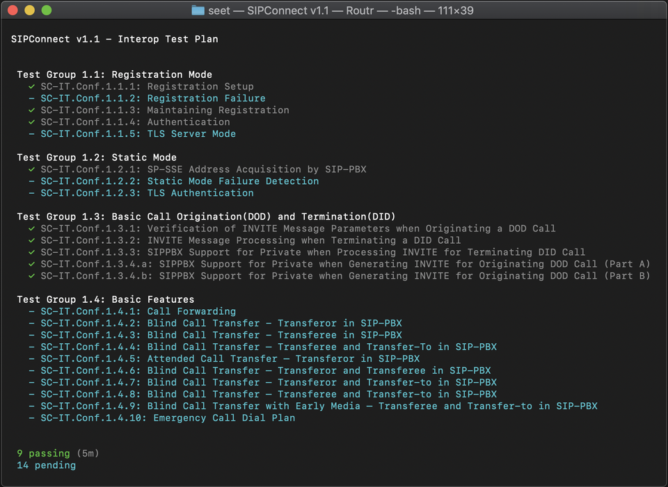

# SIP End-to-End Testing

[](https://github.com/fonoster/seet/actions/workflows/gh-docker.yml)



SEET is a suite for end-to-end testing of SIP deployments. We aim to add useful artifacts to help test and troubleshoot any SIP device or software. SEET is inspired in [pysipp](https://github.com/SIPp/pysipp).

## Available Versions

You can see all images available to pull from Docker Hub via the [Tags](https://hub.docker.com/repository/docker/fonoster/seet) page. Docker tag names that begin with a "change type" word such as task, bug, or feature are available for testing and may be removed at any time.

## Installation

You can clone this repository and manually build it.

```
git clone https://github.com/fonoster/seet
cd seet
docker build -t fonoster/seet:%%VERSION%% .
```

Otherwise, you can pull this image from the docker index.

```
docker pull fonoster/seet:%%VERSION%%
```

## Usage Example

The following is a basic example of using this image. Be sure to add the port of every User Agent Server. Also if you use an udp  mode in your scenario (e.g `u1`), you must also bind the port in docker with the corresponding udp notation.

```
docker run \
  -v $(pwd)/seet.json:/seet.json \
  -v $(pwd)/scenarios:/scenarios \
  -p 7060:7060/udp \
  -t fonoster/seet 
```

or with NodeJS

```
# Requires of sipp 3.6.0-r2 installed in the host
npm i -g @fonoster/seet
SCENARIOS=$(pwd)/seet_example.json seet
```

## Environment Variables

Environment variables are used in the entry point script to render configuration templates. You can specify the values of these variables during `docker run`, `docker-compose up`, or in Kubernetes manifests in the `env` array.

- `SCENARIOS` - Changes the default path to the scenario file.

## Exposed ports

None

## Volumes

- `/scenarios` - Location for your SIPp `xml` files
- `/seet.json` - Default location for your scenarios file

## Contributing

Please read [CONTRIBUTING.md](https://github.com/fonoster/fonoster/blob/master/CONTRIBUTING.md) for details on our code of conduct and the process for submitting pull requests to us.

## Authors

- [Pedro Sanders](https://github.com/psanders)

See the list of contributors who [participated](https://github.com/fonoster/seet/contributors) in this project.

## License

Copyright (C) 2022 by Fonoster Inc. MIT License (see [LICENSE](https://github.com/fonoster/fonoster/blob/master/LICENSE) for details).
